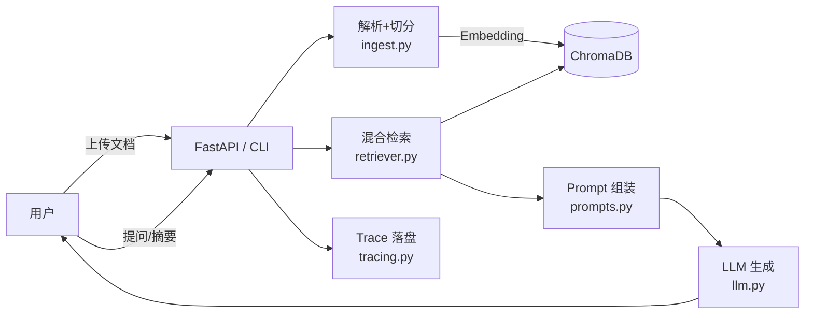
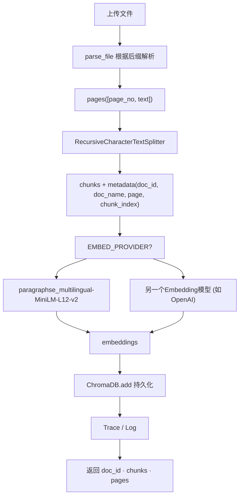
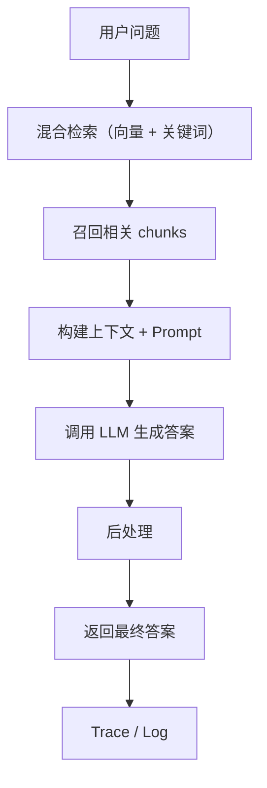

# 企业资料处理 Copilot · MVP

> 24 小时 AI 实作挑战交付 · 目标：读取少量企业资料，支持问答引用与结构化摘要，保留关键日志，并可通过 Web / API / CLI 三种入口调用。

---

## 目录

1. [功能亮点](#功能亮点)  
2. [项目结构](#项目结构)  
3. [运行准备](#运行准备)  
4. [启动方式](#启动方式)  
5. [核心链路与架构图](#核心链路与架构图)  
6. [快速体验](#快速体验)  
7. [API 说明](#api-说明)  
8. [数据库管理 CLI](#数据库管理-cli)  
9. [测试与质量保障](#测试与质量保障)  
10. [AI 协作记录](#ai-协作记录)  
11. [真实排错记录](#真实排错记录)  
12. [运行截图（示例）](#运行截图示例)  
13. [参考资料](#参考资料)  

---

## 功能亮点

- ✅ **RAG 关键链路**：文档解析 → 向量化 → 混合检索（向量 + 关键词）→ CrossEncoder + QA 抽取 rerank → 带引用问答 / JSON 摘要。  
- ✅ **多入口体验**：CLI（ingest / ask / summarize / db）、FastAPI REST 接口、内置单页 Web 前端。  
- ✅ **可控本地模型**：默认使用 `paraphrase-multilingual-MiniLM-L12-v2` 嵌入、本地交叉编码器与中文抽取式 QA 模型，离线即可运行。  
- ✅ **可观测性**：每次请求生成 trace(JSON) + 运行日志，方便复盘与调试。  
- ✅ **数据库管理**：支持统计、列表、预览、按文档删除、重置等运维命令。  

---

## 项目结构

```text
MVP/
├── app/
│   ├── cli.py              # CLI 入口 (ingest / ask / summarize / db)
│   ├── main.py             # FastAPI 应用（REST + Web 前端）
│   ├── ingest.py           # 文档解析 & 入库
│   ├── retriever.py        # 向量 + 关键词混合检索 + rerank
│   ├── rerank.py           # CrossEncoder + QA 抽取 reranker
│   ├── pipeline.py         # QA / 摘要业务流程
│   ├── llm.py              # Embedding & Chat 接口封装
│   ├── store.py            # ChromaDB collection 管理
│   ├── config.py           # Settings（含 rerank/QA 配置）
│   └── tracing.py          # trace 日志写入
├── web/
│   └── index.html          # 零构建单页前端
├── samples/                # 示例文档
├── traces/                 # 运行时 trace（自动生成）
├── logs/                   # 运行日志（自动生成）
├── tests/test_api.py       # 基础集成测试
├── requirements.txt
├── .env.example
└── README.md
```

---

## 运行准备

1. **系统要求**：Python 3.11+，Windows/macOS/Linux 均可。  
2. **虚拟环境**：
   ```bash
   python -m venv .venv
   # Windows:
   .venv\Scripts\activate
   # macOS / Linux:
   source .venv/bin/activate
   ```
3. **安装依赖**：
   ```bash
   pip install -r requirements.txt
   ```
   首次运行会自动下载 HuggingFace 模型（交叉编码器 + QA）；若在中国大陆环境，建议配置代理或设置 `HF_ENDPOINT`。
4. **配置环境变量**：复制 `.env.example` 为 `.env`，至少配置：
   ```env
   LLM_BASE_URL=...
   LLM_API_KEY=...
   EMBED_PROVIDER=local          # 默认为本地嵌入，可改为 api
   HTTP_PROXY=                   # 若有代理，填入 http://host:port
   ```
   - 若使用外部 OpenAI 兼容服务，可将 `EMBED_PROVIDER` 切换为 `api` 并填写 `EMBED_BASE_URL`、`EMBED_API_KEY`、`EMBED_MODEL`。
   - Rerank/QA 模型默认已在 `config.py` 中设定，可按需调整。

---

## 启动方式

### 1. 命令行工具

```bash
# 文档入库
python -m app.cli ingest samples/sample_contract.md

# 提问
python -m app.cli ask "合同的违约责任有哪些？"

# 结构化摘要
python -m app.cli summarize sample_report.txt
```

### 2. FastAPI 服务

```bash
# 默认：0.0.0.0:8000
python -m app.main
# 或 uvicorn app.main:app --reload
```

访问：`http://127.0.0.1:8000`（REST API）  
前端页面：`http://127.0.0.1:8000/web/`

---

## 核心链路与架构图

### 总体架构



### 文档入库流程（Ingest）



### 问答流程（Ask）



### 摘要流程（Summarize）


---

## 快速体验

### 1. 样本文档入库

```bash
python -m app.cli ingest samples/sample_contract.md
python -m app.cli ingest samples/sample_report.txt
```

### 2. 命令行提问

```bash
python -m app.cli ask "这份合同的签约日期是什么时候？"
```

示例输出：

```text
答案: 签约日期为 2025 年 3 月 15 日 [1]
引用:
  [1] sample_contract.md p0 score=0.4941
  [2] sample_contract.md p0 score=0.4165
```

### 3. 结构化摘要

```bash
python -m app.cli summarize sample_report.txt
```

示例输出（节选）：

```json
{
  "summary": {
    "title": "2025 年 Q1 销售部门工作总结",
    "key_points": [
      "本季度销售收入 4200 万元，同比增长 12%",
      "新签约客户 17 家，其中大客户 3 家"
    ],
    "entities": ["政务云", "华通集团", "张明达"],
    "action_items": ["推出中小客户套餐", "启动新人导师制"],
    "risks": ["中小客户流失率上升至 15%"]
  }
}
```

### 4. Web 前端

启动服务后访问 `http://127.0.0.1:8000/web/`，可上传文档、发起问答或摘要并查看引用细节。

---

## API 说明

| Method | Path               | 描述                         | 示例请求体 |
| ------ | ------------------ | ---------------------------- | ---------- |
| GET    | `/api/health`      | 健康检查                     | - |
| GET    | `/api/documents`   | 已入库文档列表               | - |
| POST   | `/api/upload`      | 上传文件并入库               | `multipart/form-data` |
| POST   | `/api/ask`         | 问答（`top_k` 可选，默认 4） | `{ "question": "..." }` |
| POST   | `/api/summarize`   | 结构化摘要                   | `{ "doc_name": "sample_report.txt", "top_k": 8 }` |

---

## 数据库管理 CLI

```bash
python -m app.cli db stats                 # 查看总 chunk 与按文档统计
python -m app.cli db peek -n 5             # 预览前 N 条记录
python -m app.cli db list                  # 列出所有 chunk
python -m app.cli db delete sample_contract.md  # 删除指定文档
python -m app.cli db reset                 # 清空并重建 collection
```

---

## 测试与质量保障

- **测试**：`pytest tests/test_api.py`
- **日志**：`logs/run.log` 记录运行信息；`traces/*.json` 保存每次请求的检索命中、Prompt、回答等中间过程。
- **可观测性**：CLI / Web 输出引用列表，方便核查来源；trace 可用于复现整条链路。

---

## AI 协作记录

1. **方案选型**：与 AI（Codex）讨论在 24h 约束下快速交付，确定以 RAG 单链路 + rerank 为核心。  
2. **Prompt 设计**：AI 提供带引用标注的问答 Prompt 与 JSON Schema 摘要模板，人工微调后落地。  
3. **调试排错**：AI 协助定位嵌入维度不一致、实体问答排序失真等问题，并提出混合检索与 rerank 策略。  
4. **文档生成**：README 草稿由 AI 根据仓库现状生成，人工校验后定稿。

---

## 真实排错记录

> **问题1**：实体类问题（如“甲方是谁”）的引用排序错误，`[1]` 未指向正确段落。  
> **排查**：向量检索对短句无判别力 → 引入关键词检索仍有偏差 → 最终结合 CrossEncoder rerank + 中文抽取式 QA，增加实体/日期加权。  
> **结果**：`[1]` 精确定位答案所在段落，CLI 与 Web 回答一致，trace 记录 rerank 细节。
> **方法**：
1.	混合检索：向量检索 + 关键词检索合并排序，短句实体问答时提升关键词权重。
2.	中文关键词增强：新增中文 n-gram 提取与实体问法识别，针对“甲方：”“甲方为”做额外加权。
3.	本地 Embedding：改用多语言模型 paraphrase-multilingual-MiniLM-L12-v2，提升中文语义与排序。
4.	动态阈值：保持 SCORE_THRESHOLD，但实体命中可越过，避免返回“(无引用)”的空结果。

> **问题2**：同一文档被重复入库了 3 次（8 chunks 里有 6 个是重复的）。
> **结果**：修复入库去重逻辑——如果同一 doc_id 已存在则先删除旧数据再重新入库。


---

## 运行截图示例

### Web问答实例


命令行返回：
 

### CLI 结构化摘要
命令行执行 python -m app.cli summarize sample_report.txt：

Web端：


---

## 参考资料

- [ChromaDB 文档](https://docs.trychroma.com/)
- [Sentence Transformers](https://www.sbert.net/)
- [CrossEncoder rerank 示例](https://www.sbert.net/examples/applications/cross-encoder/README.html)

---

## 运行环境

- Python 3.11+
- Windows / macOS / Linux
- 需具备可用的 LLM API Key（DeepSeek / 通义千问 / OpenAI 等兼容协议）
- 默认本地嵌入与 rerank/QA 模型，离线可运行；若使用外部 Embedding，请确保维度一致

---

## 许可

MIT
